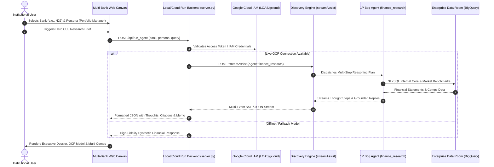

# Google Cloud Financial Research Agent Platform
> **Institutional Multi-Agent Research Platform & Multi-Bank Simulator**  
> Backed by Google Cloud 1P Boq Agent (`finance_research`) in Gemini Enterprise & Vertex AI Agent Builder.

[](https://cloud.google.com)
[](https://cloud.google.com/products/agent-builder)
[](LICENSE)
[](https://python.org)

---

## Executive Summary

The **Financial Research Agent Platform** is an enterprise-grade solution built for Tier-1 financial institutions, neobanks, asset managers, and investment banks. It automates institutional financial analysis by synthesizing internal proprietary balance sheet data with external live capital market benchmarks.

Unlike generic conversational bots, this platform is deeply specialized for the financial sector:
* **Multi-Bank Simulation Engine:** Dynamically transforms the entire user interface, brand styling, logos, regulatory frameworks, and balance sheet metrics across **6 European banking institutions**.
* **6 Institutional Personas:** Tailored workflows for Portfolio Managers, Research Analysts, Sales/Quant Traders, Business Line Managers, Investment Banking Analysts, and Compliance Officers.
* **24 Hero CUJs (Customer Use Journeys):** 4 high-conviction workflows per persona covering earnings scrambles, DCF/LBO models, peer multiples, covenant tests, and MiCA/DORA compliance.
* **Google Cloud 1P Engine:** Integrates with Google's First-Party Boq Agent (`finance_research`) on Vertex AI Agent Builder and Discovery Engine via streaming assist protocols (`streamAssist`).
* **High-Resilience Demo Engine:** Built-in offline fallback and latency masking to guarantee flawless executive demonstrations without cold-start delays or credential timeouts.

---

## Multi-Bank Simulation Engine

The platform features an instant identity switcher that completely re-skins the application in real time using CSS Custom Properties and institutional profiles:

| Bank | Brand Identity | Regulatory Authority | Banking License | Strategic Focus |
| :--- | :--- | :--- | :--- | :--- |
| **N26 Bank** | The Mobile Bank (Berlin) | BaFin / ECB | Full Banking License | Mobile Retail & Crypto Wealth |
| **Revolut** | Global Financial SuperApp (London) | Bank of Lithuania / ECB | Specialised Bank | Global FX, Wealth & Crypto |
| **Trade Republic** | Europe's Leading Wealth Platform (Berlin) | BaFin / Bundesbank | Full Banking License | Automated Savings & Brokerage |
| **Deutsche Bank** | Global Hausbank (Frankfurt am Main) | BaFin / ECB SSM | Global Hausbank | Corporate & Investment Banking |
| **Monzo** | Makes Money Work For Everyone (London) | PRA / FCA | UK Authorised Bank | Consumer Finance & Lending |
| **bunq** | Bank of the Free (Amsterdam) | DNB (De Nederlandsche Bank) | EU Banking Permit | Sustainable Digital Banking |

Each simulation dynamically updates:
* Corporate color palettes, header ribbons, and custom SVG logos.
* Regulators (BaFin, ECB, PRA, FCA, DNB) and deposit guarantee schemes.
* Digital identity connectors and email domains (`@n26.com`, `@revolut.com`, `@db.com`, etc.).
* Institutional financial statements, peer multiples, and balance sheet ratios.

---

## The 6 Personas & 24 Hero CUJs

```
┌────────────────────────────────────────────────────────────────────────┐
│                   Institutional Research Brief                         │
└───────────────────────────────────┬────────────────────────────────────┘
                                    │
       ┌────────────────────────────┼────────────────────────────┐
       ▼                            ▼                            ▼
┌──────────────┐             ┌──────────────┐             ┌──────────────┐
│  Buy-Side    │             │  Sell-Side   │             │   Trading    │
│  Portfolio   │             │  Research    │             │   Sales &    │
│  Manager     │             │  Analyst     │             │ Quant Trader │
└──────┬───────┘             └──────┬───────┘             └──────┬───────┘
       │                            │                            │
       ├─ Due Diligence Memo        ├─ Earnings Scramble         ├─ Pre-Market Briefing
       ├─ Target Screening          ├─ Consensus Variance        ├─ Alpha Backtesting
       ├─ Valuation Comps           ├─ Equity Research Note      ├─ Block Order Routing
       └─ Covenant Stress Test      └─ Sell-Side Revision        └─ Volatility Hedging
                                    │
       ┌────────────────────────────┼────────────────────────────┐
       ▼                            ▼                            ▼
┌──────────────┐             ┌──────────────┐             ┌──────────────┐
│  Strategy    │             │ Investment   │             │ Compliance   │
│  Business    │             │   Banking    │             │    & KYC     │
│  Line Mgr    │             │   Analyst    │             │   Manager    │
└──────┬───────┘             └──────┬───────┘             └──────┬───────┘
       │                            │                            │
       ├─ Competitive Landscape     ├─ Data Room Diligence       ├─ Alert Fatigue Clearing
       ├─ NIM Margin Sensitivity    ├─ LBO / DCF Model           ├─ PEP & Sanctions Scan
       ├─ Deposit Beta Modeling     ├─ M&A Pitch Book            ├─ MiCA Travel Rule Check
       └─ Multi-Branch Profit       └─ Synergies Valuation       └─ BaFin/DORA Audit Trail
```

---

## Architectural Architecture

The platform connects to Google Cloud's AI infrastructure:



---

## Quickstart

### Prerequisites
* Python 3.10+
* Google Cloud CLI (`gcloud`) authenticated to an authorized project (e.g., `ai-cartridge`).
* Optional: Docker & Docker Compose.

### Local Execution (Zero-Install)
Clone the repository and launch the server:
```bash
git clone https://github.com/tanju-tanju/financial-research-agent.git
cd financial-research-agent

# Run with Python standard library
python3 server.py
```
Open your browser at:
```
http://localhost:8085
```

To run on a custom port:
```bash
PORT=8090 python3 server.py
```

### Running with Docker
```bash
# Build and run with docker-compose
docker-compose up --build
```

---

## Deployment to Google Cloud Run

To deploy the platform to Google Cloud Run with warm instances:
```bash
chmod +x deploy.sh
./deploy.sh
```

The script automatically:
1. Enables required Cloud APIs (`run`, `artifactregistry`, `cloudbuild`, `discoveryengine`).
2. Builds the container image with Cloud Build.
3. Deploys to Cloud Run in `europe-west3` with `--min-instances 1` to eliminate cold starts during live executive demos.

---

## Repository Structure

```
financial-research-agent/
├── index.html                   # Multi-Bank Simulation Canvas (1,700+ lines)
├── server.py                    # Enterprise HTTP Backend (Live + Fallback)
├── Dockerfile                   # Hardened Container Definition
├── docker-compose.yml           # Container Orchestration
├── deploy.sh                    # Cloud Run Automated Deployment
├── requirements.txt             # Minimal Dependencies
├── .gitignore                   # Ignore Rules
├── README.md                    # English Master Documentation
├── README_DE.md                 # German Master Documentation
├── ASSET_REPLICATION_GUIDE.md   # Field Enablement Guide for CE & Sales
├── agent_registry/              # Google Cloud Agent Cards
│   ├── finance_research_card.json
│   └── n26_supervisor_card.json
├── docs/
│   └── assets/
│       └── slides/              # Executive Pitch Deck Slides (slide_1, slide_3, etc.)
└── tests/
    ├── inspect_agents.py        # Discovers registered Discovery Engine agents
    ├── test_direct_fra.py       # Validates 1P Boq Agent streamAssist endpoint
    └── test_server_logic.py     # End-to-end integration test
```

---

## Verification & Testing

Verify that the 1P Boq agent and backend logic are functioning:

```bash
# 1. Discover all registered agents in the project
python3 tests/inspect_agents.py

# 2. Test direct streamAssist connection to finance_research
python3 tests/test_direct_fra.py

# 3. Test end-to-end server query execution
python3 tests/test_server_logic.py
```

---

## Field Enablement & Asset Replication

For Google Cloud Customer Engineers, Solution Specialists, and Partner Architects who want to replicate this platform for other accounts (UBS, BNP Paribas, Santander, DZ Bank, etc.):

👉 Consult [ASSET_REPLICATION_GUIDE.md](docs/ASSET_REPLICATION_GUIDE.md) for the 15-minute white-labeling playbook!
