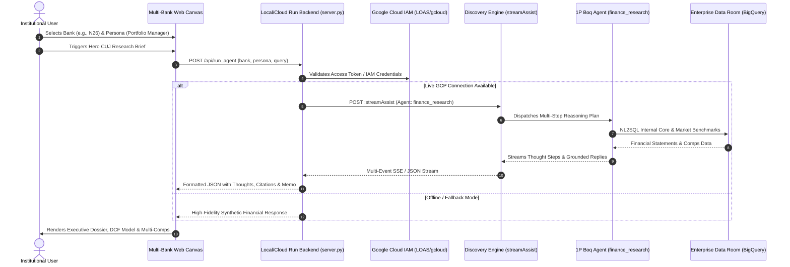

# Google Cloud Financial Research Agent Platform
> **Institutional Multi-Agent Research Platform & Multi-Bank Simulator**  
> Backed by Google Cloud 1P Boq Agent (`finance_research`) in Gemini Enterprise & Vertex AI Agent Builder.

[](https://cloud.google.com)
[](https://cloud.google.com/products/agent-builder)
[](LICENSE)
[](https://python.org)

---

## Executive Summary

The **Financial Research Agent Platform** is an enterprise-grade solution built for Tier-1 financial institutions, neobanks, asset managers, and investment banks. It automates institutional financial analysis by synthesizing internal proprietary balance sheet data with external live capital market benchmarks.

Unlike generic conversational bots, this platform is deeply specialized for the financial sector:
* **Multi-Bank Simulation Engine:** Dynamically transforms the entire user interface, brand styling, logos, regulatory frameworks, and balance sheet metrics across **6 European banking institutions**.
* **6 Institutional Personas:** Tailored workflows for Portfolio Managers, Research Analysts, Sales/Quant Traders, Business Line Managers, Investment Banking Analysts, and Compliance Officers.
* **24 Hero CUJs (Customer Use Journeys):** 4 high-conviction workflows per persona covering earnings scrambles, DCF/LBO models, peer multiples, covenant tests, and MiCA/DORA compliance.
* **Google Cloud 1P Engine:** Integrates with Google's First-Party Boq Agent (`finance_research`) on Vertex AI Agent Builder and Discovery Engine via streaming assist protocols (`streamAssist`).
* **High-Resilience Demo Engine:** Built-in offline fallback and latency masking to guarantee flawless executive demonstrations without cold-start delays or credential timeouts.


---

## Comprehensive Documentation Suite

| Document | Purpose |
| :--- | :--- |
| 📐 [**System Architecture (`docs/ARCHITECTURE.md`)**](docs/ARCHITECTURE.md) | In-depth technical architecture: multi-bank simulation, streamAssist RPC, dual-tier BigQuery, deterministic math, and WORM audit vault. |
| 🔌 [**REST API Reference (`docs/API_REFERENCE.md`)**](docs/API_REFERENCE.md) | Complete OpenAPI / REST documentation for all endpoints (`/api/status`, `/api/banks`, `/api/personas`, `/api/run_agent`, `/api/run_pipeline`). |
| 🎯 [**24 Hero CUJ Catalog (`docs/CUJ_CATALOG.md`)**](docs/CUJ_CATALOG.md) | Exhaustive breakdown of all 24 Customer Use Journeys across 6 Personas with prompts, SQL queries, and deliverable specs. |
| 🧪 [**Evaluation & Benchmark Guide (`docs/EVALUATION_GUIDE.md`)**](docs/EVALUATION_GUIDE.md) | 10 golden benchmark test cases, quantitative scoring rubrics, and automated validation runner. |
| 📊 [**Data Room Catalog (`data/README.md`)**](data/README.md) | Data dictionary and schemas for all 8 synthetic institutional JSONL datasets. |
| 🗄️ [**BigQuery DDL & Views (`sql/README.md`)**](sql/README.md) | Provisioning automation, DDL schemas for core & market tiers, and authorized security views. |
| 🚀 [**Field Enablement Blueprint (`ASSET_REPLICATION_GUIDE.md`)**](ASSET_REPLICATION_GUIDE.md) | 15-minute white-labeling and field enablement playbook for Google Cloud Customer Engineers. |

---

## Multi-Bank Simulation Engine

The platform features an instant identity switcher that completely re-skins the application in real time using CSS Custom Properties and institutional profiles:

| Bank | Brand Identity | Regulatory Authority | Banking License | Strategic Focus |
| :--- | :--- | :--- | :--- | :--- |
| **N26 Bank** | The Mobile Bank (Berlin) | BaFin / ECB | Full Banking License | Mobile Retail & Crypto Wealth |
| **Revolut** | Global Financial SuperApp (London) | Bank of Lithuania / ECB | Specialised Bank | Global FX, Wealth & Crypto |
| **Trade Republic** | Europe's Leading Wealth Platform (Berlin) | BaFin / Bundesbank | Full Banking License | Automated Savings & Brokerage |
| **Deutsche Bank** | Global Hausbank (Frankfurt am Main) | BaFin / ECB SSM | Global Hausbank | Corporate & Investment Banking |
| **Monzo** | Makes Money Work For Everyone (London) | PRA / FCA | UK Authorised Bank | Consumer Finance & Lending |
| **bunq** | Bank of the Free (Amsterdam) | DNB (De Nederlandsche Bank) | EU Banking Permit | Sustainable Digital Banking |

Each simulation dynamically updates:
* Corporate color palettes, header ribbons, and custom SVG logos.
* Regulators (BaFin, ECB, PRA, FCA, DNB) and deposit guarantee schemes.
* Digital identity connectors and email domains (`@n26.com`, `@revolut.com`, `@db.com`, etc.).
* Institutional financial statements, peer multiples, and balance sheet ratios.

---

## The 6 Personas & 24 Hero CUJs

```
┌────────────────────────────────────────────────────────────────────────┐
│                   Institutional Research Brief                         │
└───────────────────────────────────┬────────────────────────────────────┘
                                    │
       ┌────────────────────────────┼────────────────────────────┐
       ▼                            ▼                            ▼
┌──────────────┐             ┌──────────────┐             ┌──────────────┐
│  Buy-Side    │             │  Sell-Side   │             │   Trading    │
│  Portfolio   │             │  Research    │             │   Sales &    │
│  Manager     │             │  Analyst     │             │ Quant Trader │
└──────┬───────┘             └──────┬───────┘             └──────┬───────┘
       │                            │                            │
       ├─ Due Diligence Memo        ├─ Earnings Scramble         ├─ Pre-Market Briefing
       ├─ Target Screening          ├─ Consensus Variance        ├─ Alpha Backtesting
       ├─ Valuation Comps           ├─ Equity Research Note      ├─ Block Order Routing
       └─ Covenant Stress Test      └─ Sell-Side Revision        └─ Volatility Hedging
                                    │
       ┌────────────────────────────┼────────────────────────────┐
       ▼                            ▼                            ▼
┌──────────────┐             ┌──────────────┐             ┌──────────────┐
│  Strategy    │             │ Investment   │             │ Compliance   │
│  Business    │             │   Banking    │             │    & KYC     │
│  Line Mgr    │             │   Analyst    │             │   Manager    │
└──────┬───────┘             └──────┬───────┘             └──────┬───────┘
       │                            │                            │
       ├─ Competitive Landscape     ├─ Data Room Diligence       ├─ Alert Fatigue Clearing
       ├─ NIM Margin Sensitivity    ├─ LBO / DCF Model           ├─ PEP & Sanctions Scan
       ├─ Deposit Beta Modeling     ├─ M&A Pitch Book            ├─ MiCA Travel Rule Check
       └─ Multi-Branch Profit       └─ Synergies Valuation       └─ BaFin/DORA Audit Trail
```

---

## Multi-Stage Sequential Workflow Pipeline (Drag & Drop Series Chaining)

The platform enables analysts to combine **1 to N specialist functions in series** into an automated, multi-step research pipeline:
* **Mouse Drag & Drop Lane:** Drag any hero CUJ card directly onto the horizontal sequence shelf with the mouse, or use the accessible 1-click `+ In Pipeline` button.
* **Arbitrary Multi-Instance Chaining:** Combine identical or different specialist functions across all 6 Personas (e.g., Step 1: IB Analyst M&A Diligence ➔ Step 2: Portfolio Manager Valuation Comps ➔ Step 3: Compliance Manager PEP Screening).
* **Step Prompt Inspector & Token Insertion:** Edit the research prompt for each individual step before execution. Quick-insert dynamic variable tokens:
  * `{BANK_NAME}`: Resolves dynamically to the active bank institution.
  * `{PREVIOUS_RESULT}` / `{VORHERIGES_ERGEBNIS}`: Forwards intermediate findings from previous steps.
  * `+Zins-Stresstest`: Injects +200 bps ECB rate shock parameters.
  * `+Regulatorik`: Injects BaFin, ECB SSM, and MiCA regulatory criteria.
* **Context Chaining:** Intermediate analytical outputs from Step $i$ are automatically propagated to Step $i+1$ as structured context.
* **Pre-Configured Enterprise Presets:**
  * 🏛️ **M&A Due Diligence Suite** (3 steps)
  * 📈 **Earnings Scramble & NIM Wrap** (3 steps)
  * 🛡️ **MiCA Crypto & AML Compliance Audit** (3 steps)
  * 🌐 **360° Institutional Bank Audit** (4 steps)
* **Execution & Step-by-Step Inspection:** Triggered explicitly via **"🚀 Execute Pipeline in Series"**. Real-time progress bar and status indicators update live (`⏱️` ➔ `🔄` ➔ `✅`). The Results & Artifacts panel provides an interactive step navigator to inspect both the **Consolidated Master Dossier** and discrete step-by-step findings.

---

## Architectural Architecture

The platform connects to Google Cloud's AI infrastructure:



---

## Quickstart

### Prerequisites
* Python 3.10+
* Google Cloud CLI (`gcloud`) authenticated to an authorized project (e.g., `ai-cartridge`).
* Optional: Docker & Docker Compose.

### Local Execution (Zero-Install)
Clone the repository and launch the server:
```bash
git clone https://github.com/tanju-tanju/financial-research-agent.git
cd financial-research-agent

# Run with Python standard library
python3 server.py
```
Open your browser at:
```
http://localhost:8085
```

To run on a custom port:
```bash
PORT=8090 python3 server.py
```

### Running with Docker
```bash
# Build and run with docker-compose
docker-compose up --build
```

---

## Deployment to Google Cloud Run

To deploy the platform to Google Cloud Run with warm instances:
```bash
chmod +x deploy.sh
./deploy.sh
```

The script automatically:
1. Enables required Cloud APIs (`run`, `artifactregistry`, `cloudbuild`, `discoveryengine`).
2. Builds the container image with Cloud Build.
3. Deploys to Cloud Run in `europe-west3` with `--min-instances 1` to eliminate cold starts during live executive demos.

---

## Repository Structure

```
financial-research-agent/
├── index.html                   # Multi-Bank Simulation Canvas (2,300+ lines)
├── server.py                    # Enterprise HTTP Backend (Live + Fallback)
├── Dockerfile                   # Hardened Container Definition
├── docker-compose.yml           # Container Orchestration
├── deploy.sh                    # Cloud Run Automated Deployment
├── requirements.txt             # Minimal Dependencies
├── .gitignore                   # Ignore Rules
├── README.md                    # English Master Documentation
├── README_DE.md                 # German Master Documentation
├── ASSET_REPLICATION_GUIDE.md   # Field Enablement Guide for CE & Sales
├── docs/                        # Comprehensive Technical Documentation
│   ├── ARCHITECTURE.md          # Technical Architecture & Dual-Tier Data Room Spec
│   ├── API_REFERENCE.md         # Full REST API Reference & Payload Schemas
│   ├── CUJ_CATALOG.md           # 24 Hero Institutional Workflows across 6 Personas
│   ├── EVALUATION_GUIDE.md      # 10 Golden Benchmark Test Cases & Scoring Rubrics
│   ├── ASSET_REPLICATION_GUIDE.md # Synchronized Field Enablement Playbook
│   └── assets/
│       └── slides/              # Executive Pitch Deck Slides (slide_1, slide_3, etc.)
├── data/                        # Synthetic Institutional Data Room Datasets
│   ├── README.md                # Data Dictionary & Schema Documentation
│   ├── firmenkredite.jsonl      # Commercial Credit Facilities
│   ├── finanzhistorie.jsonl     # LTM Financial Statements & Cash Flows
│   ├── kredit_covenants.jsonl   # Contractual Loan Covenants (DSCR, Leverage)
│   ├── ma_deal_pipeline.jsonl   # Confidential M&A Transaction Pipeline
│   ├── capital_markets_multiples.jsonl # Listed Peer Multiples (EV/EBITDA, P/E)
│   ├── private_wealth_portfolios.jsonl # HNWI Client Asset Holdings & MiFID II
│   ├── regulatory_compliance_watchlists.jsonl # Sanctions, PEP & UBO Watchlists
│   ├── macro_transport_benchmarks.jsonl # ECB Rates, Euribor & Fuel Inflation
│   └── audit_log.jsonl          # WORM Tamper-Evident SHA-256 Audit Trail
├── sql/                         # BigQuery DDL Schemas & Provisioning Scripts
│   ├── README.md                # Provisioning & Security Architecture Guide
│   ├── 01_provision_datasets.sh # Automated BigQuery Dataset Creator
│   ├── 02_bank_internal_core_ddl.sql # Internal Core Banking Tables DDL
│   ├── 03_market_external_enrichment_ddl.sql # Market Intelligence Tables DDL
│   ├── 04_authorized_views.sql  # Role-Based Authorized Security Views
│   ├── 05_load_synthetic_data.sh# JSONL Bulk Ingestion Script (bq load)
│   ├── generate_personas_jsonl.py # Persona Catalog Generator Script
│   └── personas.jsonl           # Persona Catalog in JSON Lines Format
├── subagents/                   # Autonomous Banking Subagents Swarm
│   ├── financial_research.py    # NL2SQL, Peer Multiples, Balance Sheet Analysis
│   ├── compliance_screener.py   # Sanctions, PEP, MiCA & DORA Verification
│   ├── risk_policy.py           # MaRisk BTR 1, DSCR Sensitivity & Stress Testing
│   ├── report_synthesizer.py    # Investment Memos & Audit Trail Formulation
│   └── supervisor.py            # Workflow Routing & HITL Review Gating
├── services/                    # Production Foundation Services
│   ├── bigquery_service.py      # Dual-tier Data Room & Macro Benchmarks
│   ├── deterministic_math.py    # Zero-hallucination Arithmetic Runtime
│   ├── audit_vault.py           # WORM Append-Only Ledger & SHA-256 Chaining
│   └── observability_service.py # Distributed Tracing & Catalog Inspector
├── agent_registry/              # Google Cloud Agent Cards
│   ├── finance_research_card.json
│   ├── n26_supervisor_card.json
│   ├── financial-research-card.json
│   └── financial-compliance-screener-card.json
└── tests/
    ├── inspect_agents.py        # Discovers registered Discovery Engine agents
    ├── test_direct_fra.py       # Validates 1P Boq Agent streamAssist endpoint
    ├── test_server_logic.py     # End-to-end integration test
    └── test_html_validation.py  # Frontend layout & brand integrity test
```

---

## Verification & Testing

Verify that the 1P Boq agent and backend logic are functioning:

```bash
# 1. Discover all registered agents in the project
python3 tests/inspect_agents.py

# 2. Test direct streamAssist connection to finance_research
python3 tests/test_direct_fra.py

# 3. Test end-to-end server query execution
python3 tests/test_server_logic.py
```

---

## Field Enablement & Asset Replication

For Google Cloud Customer Engineers, Solution Specialists, and Partner Architects who want to replicate this platform for other accounts (UBS, BNP Paribas, Santander, DZ Bank, etc.):

👉 Consult [ASSET_REPLICATION_GUIDE.md](docs/ASSET_REPLICATION_GUIDE.md) for the 15-minute white-labeling playbook!
