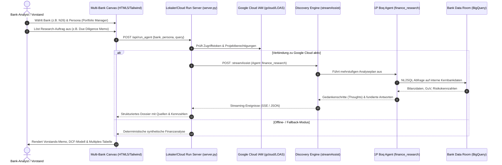

# Google Cloud Financial Research Agent Plattform
> **Institutionelle Multi-Agenten-Plattform & Bankensimulator für Finanzinstitute**  
> Angetrieben durch den Google Cloud 1P Boq Agenten (`finance_research`) in Gemini Enterprise & Vertex AI Agent Builder.

[](https://cloud.google.com)
[](https://cloud.google.com/products/agent-builder)
[](LICENSE)
[](https://python.org)

---

## Management Summary

Die **Financial Research Agent Plattform** ist eine hochspezialisierte Lösung für Banken, Neobanken, Vermögensverwalter und Investmenthäuser im europäischen Finanzraum. Sie automatisiert zeitintensive Recherche- und Analyseprozesse, indem sie interne vertrauliche Bilanzdatenbanken (Data Room) mit externen Kapitalmarktdaten und Peer-Multiples in Echtzeit verbindet.

Entwickelt für Vorstands- und Fachbereichspräsentationen, adressiert die Plattform konkrete bankfachliche Anforderungen:
* **Multi-Banken-Simulations-Engine:** Volle visuelle und fachliche Transformation der Benutzeroberfläche über **6 europäische Bankinstitute** (N26, Revolut, Trade Republic, Deutsche Bank, Monzo, bunq) via dynamischer CSS-Tokens und Bankenprofile.
* **6 institutionelle Fach-Personas:** Rollenspezifische Arbeitsabläufe für Portfolio Manager (Buy-Side), Research Analysten (Sell-Side), Sales & Quant Trader, Business Line Manager, Investment Banking Analysten und Compliance/KYC-Offiziere.
* **24 Hero CUJs (Customer Use Journeys):** 4 präzise Workflows je Persona zur Beschleunigung von Due-Diligence-Prüfungen, Earnings Scrambles, DCF/LBO-Modellen, Covenant-Stresstests und BaFin/DORA-Prüfpfaden.
* **Google Cloud 1P Engine:** Nahtlose Integration mit dem offiziellen Google First-Party Boq Agenten (`finance_research`) auf Vertex AI Agent Builder über das Streaming-Assist-Protokoll (`streamAssist`).
* **Hohe Ausfallsicherheit:** Automatische Fallback-Engine mit deterministischer Synthese, die Live-Demos vor Netzwerkunterbrechungen oder abgelaufenen Sitzungstoken schützt.

---

## Multi-Banken-Simulations-Engine

Die Plattform verfügt über einen Sofort-Umschalter für Bankidentitäten. Die gesamte Anwendung passt sich in Sekundenbruchteilen an:

| Bank | Markenidentität | Aufsichtsbehörde | Banklizenz | Strategischer Fokus |
| :--- | :--- | :--- | :--- | :--- |
| **N26 Bank** | The Mobile Bank (Berlin) | BaFin / EZB | Vollbanklizenz | Mobiles Retail & Krypto-Wealth |
| **Revolut** | Global Financial SuperApp (London) | Bank of Lithuania / EZB | Spezialbanklizenz | Globales FX, Trading & Crypto |
| **Trade Republic** | Europas führende Vermögensplattform (Berlin) | BaFin / Bundesbank | Vollbanklizenz | Automatisierte Sparpläne & Brokerage |
| **Deutsche Bank** | Global Hausbank (Frankfurt am Main) | BaFin / EZB SSM | Global Hausbank | Corporate & Investment Banking |
| **Monzo** | Makes Money Work For Everyone (London) | PRA / FCA | UK Authorised Bank | Konsumentenkredite & Digital Banking |
| **bunq** | Bank of the Free (Amsterdam) | DNB (Niederländische Zentralbank) | EU Banking Permit | Nachhaltiges Neobanking |

Mit jedem Mandantenwechsel aktualisieren sich:
* Primär-, Akzent- und Oberflächenfarben sowie offizielle SVG-Logos.
* Aufsichtsrechtliche Rahmenbedingungen (BaFin, EZB, PRA, FCA, DNB).
* Digitale Identitäten und E-Mail-Domänen (`@n26.com`, `@revolut.com`, `@db.com`, etc.).
* Bilanzen, Zinsmargen, CET1-Quoten und Peer-Group-Kennzahlen.

---

## Die 6 Personas & 24 Hero CUJs

```
┌────────────────────────────────────────────────────────────────────────┐
│                   Institutioneller Research-Auftrag                    │
└───────────────────────────────────┬────────────────────────────────────┘
                                    │
       ┌────────────────────────────┼────────────────────────────┐
       ▼                            ▼                            ▼
┌──────────────┐             ┌──────────────┐             ┌──────────────┐
│  Buy-Side    │             │  Sell-Side   │             │   Handel     │
│  Portfolio   │             │  Research    │             │   Sales &    │
│  Manager     │             │  Analyst     │             │ Quant Trader │
└──────┬───────┘             └──────┬───────┘             └──────┬───────┘
       │                            │                            │
       ├─ Due Diligence Memo        ├─ Earnings Scramble         ├─ Pre-Market Briefing
       ├─ Target Screening          ├─ Konsensus-Abweichung      ├─ Alpha Backtesting
       ├─ Bewertungs-Multiples      ├─ Equity Research Note      ├─ Block-Order Routing
       └─ Covenant-Stresstest       └─ Revision Empfehlungen     └─ Volatilitäts-Hedging
                                    │
       ┌────────────────────────────┼────────────────────────────┐
       ▼                            ▼                            ▼
┌──────────────┐             ┌──────────────┐             ┌──────────────┐
│  Strategie   │             │  Investment  │             │  Compliance  │
│  Business    │             │   Banking    │             │    & KYC     │
│  Line Mgr    │             │   Analyst    │             │   Manager    │
└──────┬───────┘             └──────┬───────┘             └──────┬───────┘
       │                            │                            │
       ├─ Wettbewerbslandschaft     ├─ Datenraum Due Diligence   ├─ Alert Fatigue Clearing
       ├─ Zinsspannen-Sensitivität  ├─ LBO / DCF Modell          ├─ PEP- & Sanktions-Scan
       ├─ Deposit Beta Modellierung ├─ M&A Pitch Book            ├─ MiCA Travel Rule Check
       └─ Filial-P&L-Optimierung    └─ Synergie-Bewertung        └─ BaFin/DORA Audit Trail
```

---

## Sequentielle Multi-Stage Workflow Pipeline (In Serie schalten per Drag & Drop)

Die Plattform ermöglicht es, **1 bis N Fachfunktionen in Serie zu schalten** und automatisiert als Research-Kette ausführen zu lassen:
* **Horizontale Drag & Drop Leiste:** Fachfunktionen können per Maus direkt aus der Liste auf die horizontale Leiste gezogen werden (HTML5 Drag & Drop) oder über die Schaltfläche **„+ In Pipeline“** mit 1 Klick hinzugefügt werden.
* **Beliebige Verkettung & Mehrfachnutzung:** Beliebige Fachfunktionen aus allen 6 Fach-Personas können frei kombiniert und auch mehrfach hintereinandergeschaltet werden (z. B. Schritt 1: IB Analyst M&A Datenraum ➔ Schritt 2: Portfolio Manager Peer Comps ➔ Schritt 3: Compliance Manager PEP Screening ➔ Schritt 4: Business Line Manager NIM Sensitivität).
* **Schritt-Prompt-Inspector & Variablen-Tokens:** Der Prompt für jeden einzelnen Schritt kann vor der Ausführung individuell editiert werden. Schnell-Einfügechips für dynamische Tokens stehen bereit:
  * `{BANK_NAME}`: Löst den Namen des aktuell gewählten Instituts auf.
  * `{VORHERIGES_ERGEBNIS}`: Übergibt die Zwischenergebnisse vorangegangener Schritte.
  * `+Zins-Stresstest`: Fügt Parameter für einen +200 bps EZB-Zinsschock ein.
  * `+Regulatorik`: Ergänzt Kriterien für BaFin, EZB SREP und MiCA.
* **Context Chaining:** Erkenntnisse und Schlüsseldaten aus Schritt $i$ werden automatisch zusammengefasst und als Kontext an Schritt $i+1$ weitergeleitet.
* **Vorkonfigurierte Banking-Presets:**
  * 🏛️ **M&A Due Diligence Suite** (3 Schritte)
  * 📈 **Earnings Scramble & NIM Wrap** (3 Schritte)
  * 🛡️ **MiCA Crypto & AML Compliance Audit** (3 Schritte)
  * 🌐 **360° Institutional Bank Audit** (4 Schritte)
* **Ausführung & Schritt-für-Schritt-Prüfung:** Die Ausführung startet erst beim Klick auf **„🚀 Pipeline in Serie ausführen“**. Live-Fortschrittsbalken und Status-Badges zeigen den aktuellen Bearbeitungsstand (`⏱️` ➔ `🔄` ➔ `✅`). In Schritt 2 („Ergebnisse & Artifacts“) erlaubt der Step-Navigator den Wechsel zwischen dem **Konsolidierten Master-Dossier** und den Einzelergebnissen jedes einzelnen Schrittes.

---

## Architektur & Datenfluss



---

## Schnellstart

### Voraussetzungen
* Python 3.10+
* Google Cloud CLI (`gcloud`) mit Zugriff auf ein berechtigtes Projekt (z.B. `ai-cartridge`).
* Optional: Docker & Docker Compose.

### Lokale Ausführung (Zero-Install)
```bash
git clone https://github.com/tanju-tanju/financial-research-agent.git
cd financial-research-agent

# Start mit Python Standardbibliothek (keine externen Pakete zwingend erforderlich)
python3 server.py
```
Öffnen Sie im Browser:
```
http://localhost:8085
```

Anderen Port verwenden:
```bash
PORT=8090 python3 server.py
```

### Ausführung mit Docker
```bash
docker-compose up --build
```

---

## Bereitstellung auf Google Cloud Run

Für produktionsnahe Kunden-Demos mit sofortiger Reaktionszeit (`--min-instances 1`):
```bash
chmod +x deploy.sh
./deploy.sh
```

---

## Verzeichnisstruktur

```
financial-research-agent/
├── index.html                   # Multi-Bank-Canvas (1.700+ Zeilen)
├── server.py                    # Enterprise HTTP-Backend (Live + Fallback)
├── Dockerfile                   # Gehärtetes Container-Image
├── docker-compose.yml           # Lokale Container-Orchestrierung
├── deploy.sh                    # Cloud Run Bereitstellungsskript
├── requirements.txt             # Minimale Abhängigkeiten
├── .gitignore                   # Ausschlussregeln
├── README.md                    # Englische Hauptdokumentation
├── README_DE.md                 # Deutsche Hauptdokumentation
├── ASSET_REPLICATION_GUIDE.md   # Field Enablement Guide für Vertrieb & Architekten
├── subagents/                   # Autonomer Banking-Subagenten-Schwarm
│   ├── financial_research.py    # NL2SQL, Peer-Multiples, Bilanzanalyse
│   ├── compliance_screener.py   # Sanktionen, PEP, MiCA & DORA Prüfung
│   ├── risk_policy.py           # MaRisk BTR 1, DSCR Sensitivität & Stresstests
│   ├── report_synthesizer.py    # Kredit-Memos & Revisionspfad-Erstellung
│   └── supervisor.py            # Workflow-Routing & Vier-Augen-Freigabe (HITL)
├── services/                    # Produktionsnahe Basisservices
│   ├── bigquery_service.py      # Dual-Tier Datenraum & Makro-Benchmarks
│   ├── deterministic_math.py    # Zero-Hallucination Rechenlogik
│   ├── audit_vault.py           # WORM Revisionsspeicher & SHA-256 Chaining
│   └── observability_service.py # Verteiltes Tracing & Agenten-Katalog
├── data/                        # Synthetische institutionelle Datenraum-Datensätze
│   ├── firmenkredite.jsonl
│   ├── finanzhistorie.jsonl
│   ├── ma_deal_pipeline.jsonl
│   ├── capital_markets_multiples.jsonl
│   └── private_wealth_depots.jsonl
├── sql/                         # BigQuery DDL Schemas & Autorisierte Views
│   └── 02_bank_internal_core_ddl.sql
├── agent_registry/              # Google Cloud Agenten-Karten
│   ├── finance_research_card.json
│   ├── n26_supervisor_card.json
│   ├── financial-research-card.json
│   └── financial-compliance-screener-card.json
├── docs/
│   └── assets/
│       └── slides/              # Präsentationsfolien (slide_1, slide_3, etc.)
└── tests/
    ├── inspect_agents.py        # Katalogisiert registrierte Agenten im Projekt
    ├── test_direct_fra.py       # Testet direkte streamAssist-Verbindung
    └── test_server_logic.py     # End-to-End Integrationstest
```

---

## Asset-Bereitstellung & Replikationsanleitung

Für Google Cloud Customer Engineers, Solution Specialists und Partner-Architekten, die diese Demo für andere Kunden (UBS, BNP Paribas, Santander, DZ Bank, Sparkassen etc.) wiederverwenden möchten:

👉 Siehe [ASSET_REPLICATION_GUIDE.md](docs/ASSET_REPLICATION_GUIDE.md) für die 15-Minuten White-Labeling-Anleitung!
