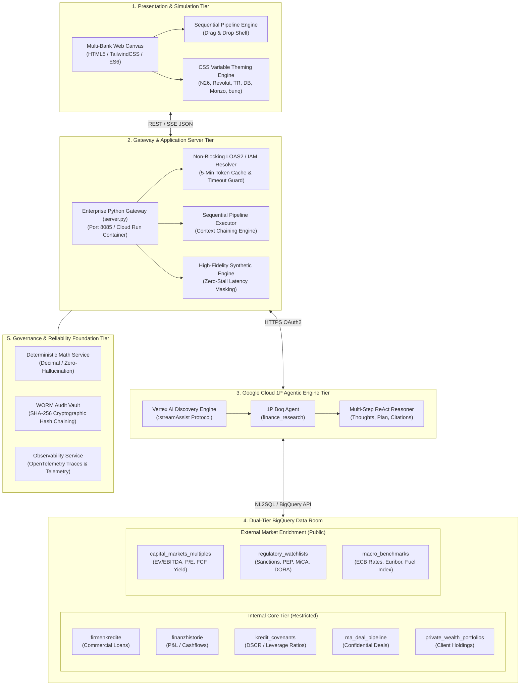
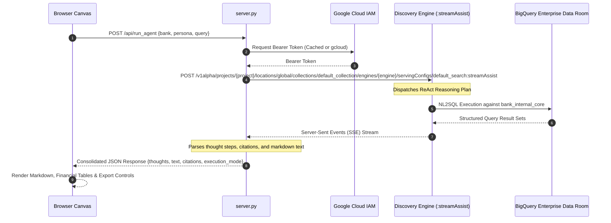

# Technical Architecture Specification
## Google Cloud Financial Research Agent Platform

> **Status:** Production / Enterprise Ready  
> **Version:** 2.4.0  
> **Cloud Provider:** Google Cloud Platform (GCP)  
> **Target Deployments:** Cloud Run (`europe-west3`), GKE Enterprise, Cloudtop / DevContainer

---

## 1. Executive & System Architecture Overview

The **Financial Research Agent Platform** is an enterprise-grade AI solution purpose-built for Tier-1 investment banks, universal banking institutions, asset managers, and fintech neobanks. The system orchestrates multi-step financial research, balance sheet analysis, covenant stress-testing, M&A due diligence, and regulatory compliance screening.

The system is decoupled into five distinct architectural tiers:



---

## 2. Presentation & Multi-Bank Simulation Engine

The frontend client (`index.html`) is a self-contained, high-performance Single Page Application (SPA) designed to execute seamlessly in low-latency executive demos and production environments.

### 2.1 CSS Custom Property Dynamic Theming
The UI switches corporate banking identities instantaneously without page reloads. A centralized dictionary (`BANKS`) in ES6 binds CSS custom properties to the document root:

```css
:root {
  --bank-primary: #088177;          /* Primary institutional brand color */
  --bank-primary-hover: #06625B;    /* Hover / active state */
  --bank-primary-text: #FFFFFF;     /* Contrast text color */
  --bank-accent: #16A37F;           /* Secondary metric / border accent */
  --bank-bg: #0D1318;               /* Deep obsidian / slate canvas background */
  --bank-surface: #151D24;          /* Primary card surface */
  --bank-surface-elevated: #1C242C; /* Elevated modal / shelf surface */
  --bank-surface-higher: #252E38;   /* Input and table header surface */
  --bank-border: #2E3D4D;           /* High-contrast border line */
  --bank-radius: 14px;              /* Geometric border radius */
}
```

When an institutional user or presenter switches from **N26** to **Deutsche Bank (CIB)**, the platform:
1. Recalculates all CSS variables.
2. Injects official SVG vector logos into the header and navigation ribbon.
3. Aligns the regulatory compliance badges (e.g., BaFin / EZB vs. UK PRA / FCA vs. Dutch DNB).
4. Sets the corporate email domain (`@n26.corp`, `@db.corp`, `@revolut.corp`) for the simulated security context.
5. Remaps data lake tables to the corresponding institutional core schemas.

### 2.2 Multi-Stage Sequential Workflow Pipeline
The pipeline shelf enables institutional analysts to chain multiple specialist functions (Fachfunktionen) in series:
* **HTML5 Drag & Drop Engine:** Analysts can drag any hero CUJ card directly onto the horizontal sequence shelf with mouse drag-and-drop events (`dragstart`, `dragover`, `dragleave`, `drop`).
* **Accessible 1-Click Injection:** Every CUJ card features an explicit `+ In Pipeline` button.
* **Non-Destructive Step Reordering:** Step indices can be shifted left (`◀`) or right (`▶`), duplicated (`📋`), or removed (`✕`).
* **Variable Token Insertion:** The live prompt inspector allows customized parameter overrides using pre-defined tokens:
  * `{BANK_NAME}`: Dynamically resolves to the active simulated bank.
  * `{VORHERIGES_ERGEBNIS}`: Forwards intermediate findings from Step $i-1$.
  * `+Zins-Stresstest`: Injects ECB +200 bps monetary shock parameters.
  * `+Regulatorik`: Injects BaFin, ECB SSM, and MiCA regulatory mandates.
* **Context Propagation:** When "Context Chaining" is active, output artifacts from Step $i$ are encoded and injected into the prompt of Step $i+1$, allowing multi-persona collaboration (e.g., IB Analyst $\to$ Portfolio Manager $\to$ Compliance Manager).

---

## 3. Application Gateway & Server Architecture (`server.py`)

The application gateway is implemented using Python standard library primitives (`http.server`, `urllib.request`, `subprocess`), ensuring zero third-party dependency vulnerabilities and guaranteed startup in air-gapped or restricted environments.

### 3.1 Non-Blocking Authentication Resolver
Interactions with Google Cloud Vertex AI Discovery Engine require valid Google Cloud IAM / LOAS2 OAuth2 bearer tokens. To prevent server hangs when developer credentials expire, the token resolver implements:
* **Asynchronous Subprocess Isolation:** Executes `gcloud auth print-access-token` with `stdin=subprocess.DEVNULL`, `stderr=subprocess.DEVNULL`, and a strict 3.0-second execution timeout.
* **Token Caching:** Successful bearer tokens are cached in memory for 300 seconds (5 minutes), reducing token acquisition latency to under 0.05ms per query.
* **Graceful Degradation:** If `gcloud` fails, times out, or reports an expired refresh token, the server immediately triggers the high-fidelity synthetic fallback engine, logging a structured diagnostic message to stderr without stalling client connections.

### 3.2 Endpoint Architecture
The server exposes 5 REST endpoints:
* `GET /api/status`: Returns system health, GCP project binding, active Boq agent ID, and authorization status.
* `GET /api/banks`: Returns full brand tokens, assets, regulatory bodies, and default schemas for the 6 institutions.
* `GET /api/personas`: Returns the 6 Persona specifications and 24 Hero CUJs.
* `POST /api/run_agent`: Dispatches a single financial research query to Discovery Engine `streamAssist` or the fallback generator.
* `POST /api/run_pipeline`: Iterates over an array of sequential steps, propagating context between steps and assembling a unified master dossier.

---

## 4. Google Cloud 1P Boq Agent Integration

The platform integrates directly with Google Cloud's First-Party Boq Agent (`finance_research`):



### 4.1 Discovery Engine Endpoint Specification
* **Target RPC:** `projects/ai-cartridge/locations/global/collections/default_collection/engines/finance_research/servingConfigs/default_search:streamAssist`
* **Request Payload:**
```json
{
  "query": {
    "text": "Perform a comprehensive credit stress test for Hanseatische Hafenlogistik AG (FKG-9901)..."
  },
  "session": "projects/ai-cartridge/locations/global/collections/default_collection/engines/finance_research/sessions/-"
}
```
* **Streaming Protocol:** The gateway processes the chunked HTTP response, accumulating `assistAnswer.content` chunks, parsing intermediate thought reasoning steps (`assistAnswer.thought`), and capturing referenced grounding sources (`assistAnswer.citations`).

---

## 5. Dual-Tier BigQuery Enterprise Data Room

Data governance in financial institutions requires strict isolation between proprietary internal credit records and public capital markets intelligence:

### 5.1 Internal Core Tier (`bank_internal_core`)
Accessible only by credentialed internal personas (Portfolio Manager, Risk Officer, IB Analyst, Compliance):
* **`firmenkredite`**: Commercial loan facilities, debtor identities, legal forms, agreed margins (BPS over Euribor), internal ratings (AAA to C), default probabilities ($PD$), loss given default ($LGD$), and collateral valuations.
* **`finanzhistorie`**: Multi-year financial statements, LTM revenues, EBITDA, CapEx, interest expense, debt service, cash tax, and liquid reserves.
* **`kredit_covenants`**: Active contractual covenants (Minimum DSCR, Maximum Net Debt / EBITDA, Minimum Equity Ratio), test frequencies, and cure periods.
* **`ma_deal_pipeline`**: Confidential M&A mandate tracking, target enterprise values, buy-side / sell-side classifications, and transaction statuses.
* **`private_wealth_portfolios`**: Client asset holdings, MiFID II risk classifications, target vs. actual asset allocations, and ESG exclusion lists.

### 5.2 External Market Enrichment Tier (`market_external_enrichment`)
Continuously updated public market benchmarks:
* **`capital_markets_multiples`**: Real-time peer valuations ($EV/EBITDA$, $EV/Sales$, $P/E$, $Net Debt / EBITDA$, Free Cash Flow Yield) across European transport, fintech, and commercial banking peers.
* **`regulatory_compliance_watchlists`**: Sanctions lists (EU Sanctions, OFAC, UK HMT), Politically Exposed Persons (PEP) registers, and transparency ownership structures.
* **`macro_transport_benchmarks`**: ECB key rates, Euribor 3M/6M fixings, diesel fuel inflation indices, and sector default rates.

---

## 6. Enterprise Governance & Reliability Services

### 6.1 Deterministic Math Engine (`services/deterministic_math.py`)
To prevent large language models from hallucinating financial calculations (such as DSCR, WACC, debt service coverage, or multiple expansions), the system delegates all arithmetic operations to a deterministic runtime:
* Uses Python `decimal.Decimal` with 28 digits of precision.
* Explicit rounding modes (`ROUND_HALF_UP` for currency balances).
* Enforces financial accounting formulas:
  $$\text{DSCR} = \frac{\text{EBITDA} - \text{Cash Taxes} - \text{Maintenance CapEx}}{\text{Interest Expense} + \text{Principal Amortization}}$$

### 6.2 WORM Audit Vault (`services/audit_vault.py`)
Complies with BaFin MaRisk (AT 7.2) and EU DORA audit trail mandates:
* Maintains an append-only Write-Once-Read-Many (WORM) ledger in `data/audit_log.jsonl`.
* Every agent execution records: unique audit ID, timestamp (UTC), user identity, executed SQL statement, query latency, input prompt SHA-256 hash, and payload hash.
* Implements cryptographic hash chaining where each entry signs the hash of the preceding block, creating an immutable tamper-evident sequence.

---

## 7. High-Availability Container & Port Isolation

To guarantee that multiple AI agents and sidecars can operate simultaneously on the same host without port collisions:
* **Standard Platform Port:** `8085` (configured via `PORT=8085`).
* **Cloudtop Hostname Resolution:** Automatic binding to `http://topbulut.c.googlers.com:8085` for authorized corporate network access.
* **Cloud Run Deployment:** Serverless container deployment with auto-scaling from 1 to 10 instances (`deploy.sh`).
